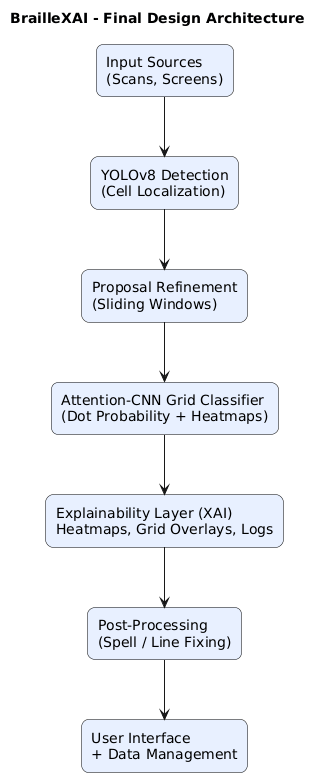

# BrailleVision-XAI

> An Explainable Multi-Stage Braille Recognition and Decoding Framework

---

## Overview

BrailleVision-XAI is a research-oriented deep learning framework designed for Braille character detection, sentence reconstruction, explainable AI analysis, and post-processing refinement.

This repository documents the progressive evolution of a multi-stage Braille recognition system combining:

- YOLOv8-based Braille detection
- Proposal refinement using sliding-window analysis
- AttentionCNN-based grid classification
- Explainable AI visualization pipelines
- SymSpell and transformer-based correction
- Cognitive/theatic sentence analysis
- Structured benchmarking and ablation studies

The repository is intentionally organized as a sequence of research notebooks that preserve the experimental progression of the framework rather than exposing only a final black-box model.

This project is currently maintained as a research architecture repository intended for publication, collaboration, and future extension.

---

## Final System Architecture

<p align="center">
  
</p>

---

## Repository Structure

```text
BrailleVision-XAI/
│
├── notebooks/
│   │
│   ├── core_pipeline/
│   │   ├── 01_braille_foundation.ipynb
│   │   ├── 02_braille_sentence_pipeline.ipynb
│   │   ├── 03_detection_and_grid_alignment.ipynb
│   │   ├── 04_attention_xai_pipeline.ipynb
│   │   │
│   │   └── context/
│   │       ├── 01_context.txt
│   │       ├── 02_context.txt
│   │       ├── 03_context.txt
│   │       └── 04_context.txt
│   │
│   ├── experiments/
│   │   ├── 05_ablation_framework.ipynb
│   │   ├── 06_results_and_visualization.ipynb
│   │   │
│   │   └── context/
│   │       ├── 05_context.txt
│   │       └── 06_context.txt
│
├── assets/
│   └── architecture/
│       └── Final-Design-Diagram.png
│
└── README.md
```

---

## Canonical Pipeline

The primary pipeline explored throughout this project is:

```text
Input Source
    ↓
YOLOv8 Detection
    ↓
Proposal Refinement
    ↓
AttentionCNN Grid Classification
    ↓
Explainability Layer (XAI)
    ↓
Post-Processing & Correction
    ↓
Structured Evaluation & Benchmarking
```

---

## Notebook Progression

| Notebook | Purpose | Main Techniques | Outputs |
|---|---|---|---|
| 01 Braille Foundation | Foundational Braille detection and evaluation | Dot mapping, clustering, uncertainty tracking | Detection overlays, accuracy logs |
| 02 Sentence Pipeline | Sentence-level reconstruction and semantic correction | SymSpell, ByT5, spacing analysis | Corrected sentences |
| 03 Detection & Grid Alignment | Spatial refinement and proposal correction | Soft-NMS, RPN snapping, tiling | Grid-aligned decoding |
| 04 Attention XAI Pipeline | Explainable AI verification framework | AttentionCNN, heatmaps, confidence maps | Character explanations |
| 05 Ablation Framework | Comparative benchmarking pipeline | Multi-method evaluation, logging | Ablation reports |
| 06 Results & Visualization | Experimental aggregation and reporting | Metrics plotting, collages | Publication-ready visualizations |

---

## Recommended Reading Paths

### Full Pipeline Understanding

`01 → 02 → 03 → 04 → 05 → 06`

### Explainable AI & Interpretability

`04 → 06`

### Benchmarking & Experimental Evaluation

`05 → 06`

### NLP & Sentence Reconstruction

`02 → 04`

---

## Core Features

- YOLOv8-based Braille cell localization
- Sliding-window proposal refinement
- Adaptive row clustering and spacing estimation
- Soft-NMS overlap preservation
- RPN-based Braille grid alignment
- AttentionCNN explainability framework
- Dot-level confidence visualization
- Transformer-assisted sentence refinement
- SymSpell dictionary correction
- Cognitive and thematic text analysis
- TTS-assisted interactive reading
- Structured benchmarking framework
- Publication-oriented result visualization

---

## Research Objectives

This project explores:

- Robust Braille recognition under noisy layouts
- Explainable AI for assistive vision systems
- Hybrid symbolic + deep learning decoding pipelines
- Sentence-level semantic refinement
- Spatially-aware Braille reconstruction
- Human-interpretable confidence analysis
- Comparative evaluation of decoding strategies

---

## Experimental Design Philosophy

Rather than exposing only a final optimized model, this repository preserves the research and engineering progression of the framework.

The notebooks intentionally document:

- Foundational baselines
- Iterative refinements
- Experimental branches
- Ablation studies
- Explainability mechanisms
- Evaluation methodologies

This structure improves:

- Reproducibility
- Transparency
- Interpretability
- Future extensibility

---

## Important Repository Note

This repository intentionally does **not** include:

- Trained model weights
- Datasets
- Proprietary experimental assets
- Deployment packages
- Large-scale generated outputs

The repository is designed as a structured research architecture and experimental framework accompanying ongoing academic work and planned publication efforts.

Researchers, collaborators, or contributors interested in extending the framework or discussing potential collaboration are encouraged to reach out directly.

---

## Current Research Focus

Current areas of investigation include:

- Explainable Braille recognition systems
- Proposal refinement for dense Braille layouts
- Attention-guided grid verification
- Semantic reconstruction under noisy detection
- Assistive AI accessibility systems
- Hybrid symbolic-neural reasoning pipelines

---

## Future Directions

Potential future extensions include:

- Multilingual Braille support
- Lightweight edge deployment
- Real-time mobile inference
- Graph-based spatial reasoning
- Transformer-native decoding
- Reinforcement-guided correction pipelines
- Multimodal accessibility interfaces

---

## Citation

If you use this repository in research or academic work, please cite appropriately after official publication.

---

## Author

Developed as a research-focused Braille recognition and explainability framework exploring the intersection of:

- Computer Vision
- Explainable AI
- Natural Language Processing
- Assistive Intelligence Systems
- Spatial Reasoning Frameworks
- Human-Centered AI
